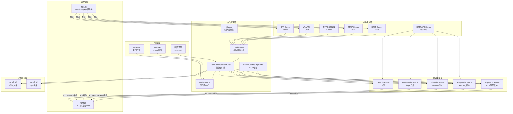
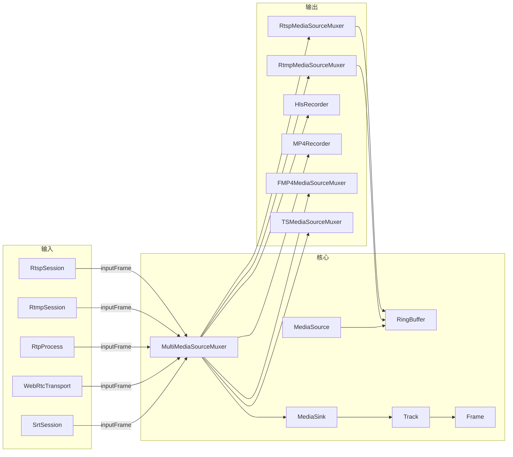
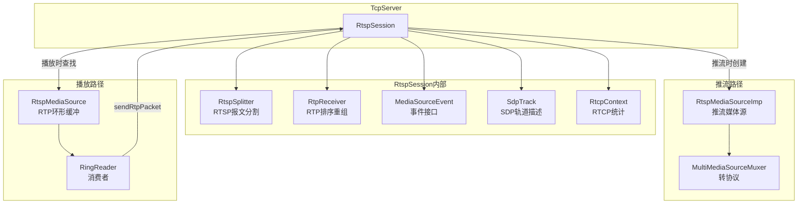
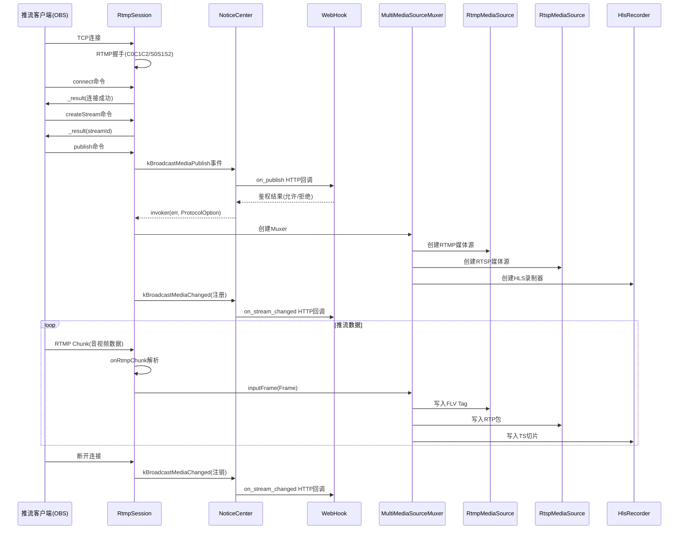
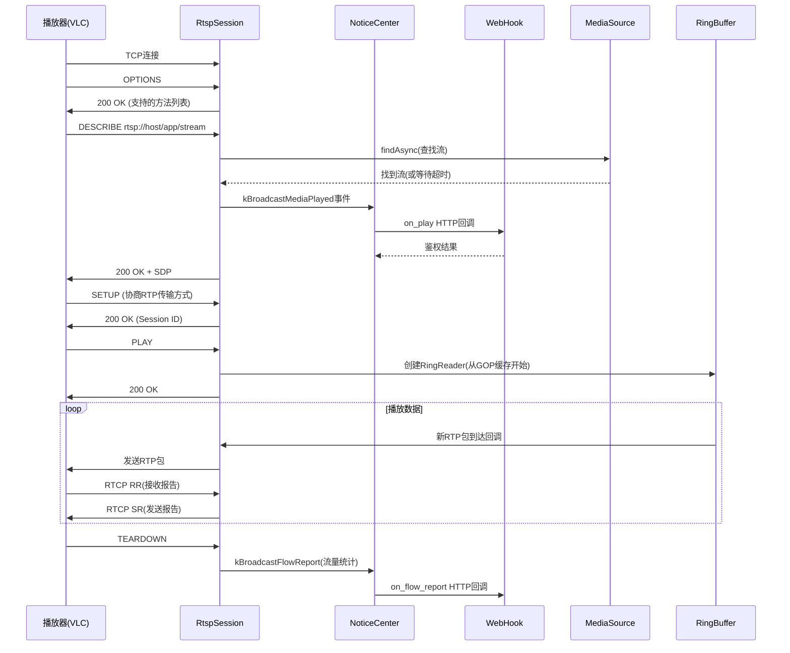
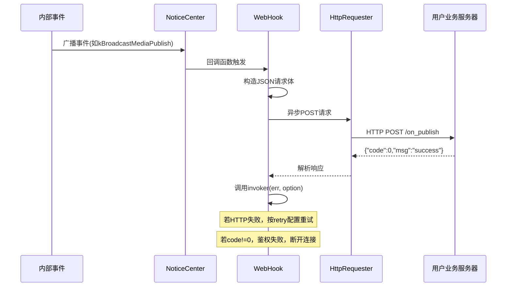
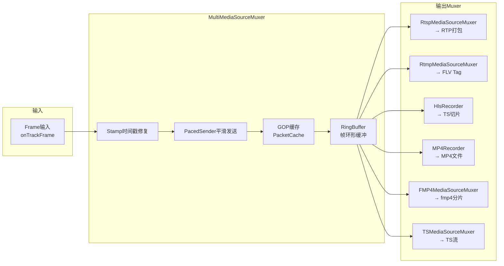

# 架构图与设计图

所有图表均使用 Mermaid 语法。

---

## 1. 系统整体分层架构图



---

## 2. 核心组件依赖图



---

## 3. RtspServer 组合结构图



---

## 4. 核心类 UML 类图

```mermaid
classDiagram
    class CodecInfo {
        +getCodecId() CodecId
        +getCodecName() string
        +getTrackType() TrackType
        +getIndex() int
        -_index int
    }

    class Frame {
        <<abstract>>
        +dts() uint64_t
        +pts() uint64_t
        +prefixSize() size_t
        +keyFrame() bool
        +configFrame() bool
        +cacheAble() bool
        +dropAble() bool
        +decodeAble() bool
    }

    class FrameImp {
        +_codec_id CodecId
        +_dts uint64_t
        +_pts uint64_t
        +_prefix_size size_t
        +_buffer BufferLikeString
    }

    class FrameDispatcher {
        +addDelegate(delegate) FrameWriterInterface*
        +delDelegate(ptr)
        +inputFrame(frame) bool
        +size() size_t
        +getVideoKeyFrames() uint64_t
        +getVideoGopSize() size_t
        -_delegates map
        -_frames uint64_t
        -_video_key_frames uint64_t
    }

    class Track {
        <<abstract>>
        +ready() bool
        +clone() Track::Ptr
        +getSdp(pt) Sdp::Ptr
        +getExtraData() Buffer::Ptr
        +getBitRate() int
        -_bit_rate int
    }

    class VideoTrack {
        +getVideoHeight() int
        +getVideoWidth() int
        +getVideoFps() float
        +getConfigFrames() vector~Frame::Ptr~
    }

    class AudioTrack {
        +getAudioSampleRate() int
        +getAudioSampleBit() int
        +getAudioChannel() int
    }

    class TrackSource {
        <<abstract>>
        +getTracks(ready) vector~Track::Ptr~
        +getTrack(type, ready) Track::Ptr
    }

    class MediaSource {
        +getSchema() string
        +getMediaTuple() MediaTuple
        +getTracks(ready) vector~Track::Ptr~
        +readerCount() int
        +totalReaderCount() int
        +seekTo(stamp) bool
        +close(force) bool
        +setupRecord(type, start, path, sec) bool
        +startSendRtp(args, cb)
        +find(schema, vhost, app, id) Ptr
        +findAsync(info, session, cb)
        +for_each_media(cb, ...)
        #regist()
        -unregist() bool
        -_schema string
        -_tuple MediaTuple
        -_listener weak_ptr~MediaSourceEvent~
        -_create_stamp time_t
        -_speed BytesSpeed[]
    }

    class MediaSourceEvent {
        +getOriginType(sender) MediaOriginType
        +getOriginUrl(sender) string
        +seekTo(sender, stamp) bool
        +close(sender) bool
        +totalReaderCount(sender) int
        +onReaderChanged(sender, size)
        +onRegist(sender, regist)
        +getLossRate(sender, type) float
        +getOwnerPoller(sender) EventPoller::Ptr
    }

    class MultiMediaSourceMuxer {
        +setMediaListener(listener)
        +setTrackListener(listener)
        +totalReaderCount() int
        +isEnabled() bool
        +setupRecord(type, start, path, sec) bool
        +startSendRtp(args, cb)
        +stopSendRtp(ssrc) bool
        #onTrackReady(track) bool
        #onAllTrackReady()
        #onTrackFrame(frame) bool
        -_rtsp RtspMediaSourceMuxer::Ptr
        -_rtmp RtmpMediaSourceMuxer::Ptr
        -_hls HlsRecorder::Ptr
        -_mp4 MediaSinkInterface::Ptr
        -_fmp4 FMP4MediaSourceMuxer::Ptr
        -_ts TSMediaSourceMuxer::Ptr
        -_ring RingType::Ptr
        -_option ProtocolOption
    }

    class RtspSession {
        +onRecv(buf)
        +onError(err)
        +onManager()
        -handleReq_Options(parser)
        -handleReq_Describe(parser)
        -handleReq_ANNOUNCE(parser)
        -handleReq_RECORD(parser)
        -handleReq_Setup(parser)
        -handleReq_Play(parser)
        -handleReq_Teardown(parser)
        -sendRtpPacket(pkt)
        -_push_src RtspMediaSourceImp::Ptr
        -_play_src weak_ptr~RtspMediaSource~
        -_play_reader RingReader::Ptr
        -_sdp_track vector~SdpTrack::Ptr~
        -_rtp_type eRtpType
    }

    class RtmpSession {
        +onRecv(buf)
        +onError(err)
        +onManager()
        -onCmd_connect(dec)
        -onCmd_publish(dec)
        -onCmd_play(dec)
        -onCmd_seek(dec)
        -onSendMedia(pkt)
        -_push_src RtmpMediaSourceImp::Ptr
        -_play_src weak_ptr~RtmpMediaSource~
        -_ring_reader RingReader::Ptr
    }

    CodecInfo <|-- Frame
    CodecInfo <|-- Track
    Frame <|-- FrameImp
    FrameDispatcher <|-- Track
    Track <|-- VideoTrack
    Track <|-- AudioTrack
    TrackSource <|-- MediaSource
    MediaSourceEvent <|-- MediaSourceEventInterceptor
    MediaSourceEventInterceptor <|-- MultiMediaSourceMuxer
    MediaSource --> MediaSourceEvent : listener
    MultiMediaSourceMuxer --> Track : manages
    RtspSession --> MultiMediaSourceMuxer : creates(push)
    RtspSession --> MediaSource : reads(play)
    RtmpSession --> MultiMediaSourceMuxer : creates(push)
    RtmpSession --> MediaSource : reads(play)
```



---

## 5. 推流流程序列图（RTMP 推流）



---

## 6. 拉流播放序列图（RTSP 播放）



---

## 7. WebHook 触发流程序列图



---

## 8. MediaSource 与 Track 数据结构关系图

```mermaid
graph TB
    subgraph MediaSource
        schema[schema: rtsp/rtmp/hls...]
        tuple[MediaTuple: vhost/app/stream]
        listener[listener: MediaSourceEvent]
        speed[_speed: BytesSpeed x4]
    end

    subgraph TrackSource
        getTracks[getTracks()]
        getTrack[getTrack(type)]
    end

    subgraph Track
        codecId[CodecId: H264/AAC...]
        trackType[TrackType: Video/Audio]
        bitRate[_bit_rate]
        delegates[FrameDispatcher::_delegates]
    end

    subgraph VideoTrack
        width[width]
        height[height]
        fps[fps]
        configFrames[configFrames: SPS/PPS/VPS]
    end

    subgraph AudioTrack
        sampleRate[sampleRate]
        channels[channels]
        sampleBit[sampleBit]
    end

    subgraph Frame
        dts[dts: 解码时间戳]
        pts[pts: 显示时间戳]
        data[data: 裸数据指针]
        size[size: 数据长度]
        prefixSize[prefixSize: 前缀长度]
        keyFrame[keyFrame: 是否关键帧]
        configFrame[configFrame: 是否配置帧]
    end

    MediaSource --> TrackSource
    TrackSource --> Track
    Track --> VideoTrack
    Track --> AudioTrack
    Track -->|dispatch| Frame
    VideoTrack -->|H264Track| Frame
    AudioTrack -->|AACTrack| Frame
```

---

## 9. 转协议引擎内部结构图


