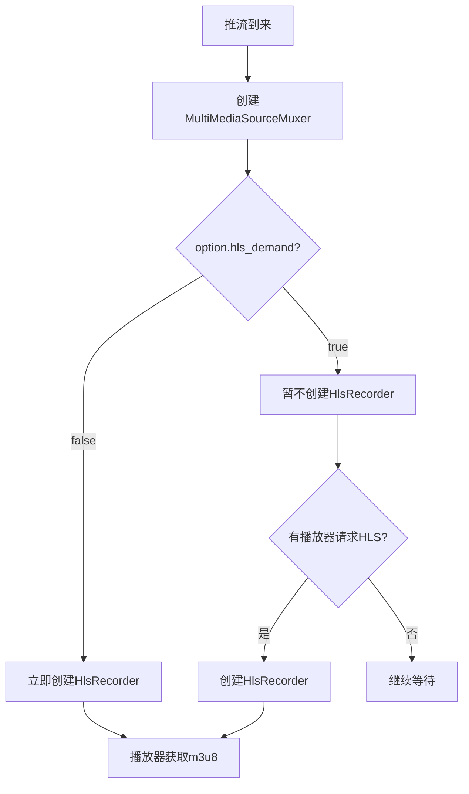

# MultiMediaSourceMuxer 类详解

## 1. 类概述

`MultiMediaSourceMuxer` 是 ZLMediaKit 的**转协议引擎核心**，位于 `src/Common/MultiMediaSourceMuxer.h`。

当一路流推入 ZLMediaKit 后，`MultiMediaSourceMuxer` 负责：
1. 接收音视频帧（`MediaSink` 接口）
2. 修复时间戳（`Stamp`）
3. 将帧写入环形缓冲区（`RingBuffer`）
4. 同时驱动多个协议输出（RTSP/RTMP/HLS/FMP4/TS/MP4）
5. 管理录制（HLS/MP4）
6. 管理 RTP 发送（GB28181 回传）

---

## 2. 继承关系

```
MediaSourceEventInterceptor  (拦截并转发 MediaSourceEvent 事件)
    └── MultiMediaSourceMuxer
            └── MediaSink    (接收 Track 和 Frame)
```

---

## 3. 成员变量

| 变量名 | 类型 | 说明 |
|--------|------|------|
| `_rtsp` | `RtspMediaSourceMuxer::Ptr` | RTSP 协议输出 |
| `_rtmp` | `RtmpMediaSourceMuxer::Ptr` | RTMP/FLV 协议输出 |
| `_hls` | `HlsRecorder::Ptr` | HLS 切片录制 |
| `_hls_fmp4` | `HlsFMP4Recorder::Ptr` | HLS-FMP4 切片录制 |
| `_mp4` | `MediaSinkInterface::Ptr` | MP4 录制 |
| `_fmp4` | `FMP4MediaSourceMuxer::Ptr` | HTTP-FMP4 输出 |
| `_ts` | `TSMediaSourceMuxer::Ptr` | HTTP-TS 输出 |
| `_ring` | `RingType::Ptr` | 帧环形缓冲区 |
| `_option` | `ProtocolOption` | 转协议配置 |
| `_tuple` | `MediaTuple` | 流标识 |
| `_dur_sec` | `float` | 流时长（点播用） |
| `_stamps` | `unordered_map<int, Stamp>` | 各轨道时间戳修复器 |
| `_paced_sender` | `shared_ptr<FramePacedSender>` | 平滑发送器 |
| `_poller` | `EventPoller::Ptr` | 所属事件线程 |
| `_is_enable` | `bool` | 是否有消费者（按需转协议优化） |
| `_video_key_pos` | `bool` | 是否已收到第一个关键帧 |
| `_rtp_sender` | `unordered_multimap` | RTP 发送器列表（GB28181） |

---

## 4. 核心函数详解

### 4.1 构造函数

```cpp
MultiMediaSourceMuxer(const MediaTuple &tuple, float dur_sec = 0.0, const ProtocolOption &option = ProtocolOption());
```

**参数：**
- `tuple`：流标识（vhost/app/stream）
- `dur_sec`：流时长，0 表示直播，>0 表示点播
- `option`：转协议配置

**初始化逻辑：**
1. 根据 `option` 决定创建哪些协议输出（按需或立即创建）
2. 创建帧环形缓冲区 `_ring`
3. 绑定到当前事件线程 `_poller`

---

### 4.2 `onTrackReady()` — Track 就绪回调

```cpp
bool onTrackReady(const Track::Ptr &track) override;
```

**触发时机：** 当某个 Track 的 `ready()` 返回 true 时（已获取 SPS/PPS 等配置信息）。

**处理逻辑：**
1. 将 Track 注册到各协议 Muxer（RTSP/RTMP/HLS 等）
2. 为该 Track 创建时间戳修复器 `Stamp`

---

### 4.3 `onAllTrackReady()` — 所有 Track 就绪回调

```cpp
void onAllTrackReady() override;
```

**触发时机：** 所有 Track 都就绪后（或超时后忽略未就绪的 Track）。

**处理逻辑：**
1. 通知各协议 Muxer 开始工作
2. 创建 GOP 缓存（`PacketCache`）
3. 通知 `_track_listener`（推流 Session）所有 Track 已就绪
4. 触发 `kBroadcastMediaChanged` 注册事件

---

### 4.4 `onTrackFrame()` — 帧数据输入

```cpp
bool onTrackFrame(const Frame::Ptr &frame) override;
```

**处理流程：**
```
frame 输入
    ↓
_paced_sender（平滑发送，可选）
    ↓
onTrackFrame_l(frame)
    ↓
Stamp::revise() 时间戳修复
    ↓
FrameStamp 包装（覆盖时间戳）
    ↓
_ring->write(frame)  写入环形缓冲
    ↓
各协议 Muxer 的 RingReader 回调
    ├── RtspMediaSourceMuxer::inputFrame()
    ├── RtmpMediaSourceMuxer::inputFrame()
    ├── HlsRecorder::inputFrame()
    ├── MP4Recorder::inputFrame()
    ├── FMP4MediaSourceMuxer::inputFrame()
    └── TSMediaSourceMuxer::inputFrame()
```

---

### 4.5 `setupRecord()` — 录制控制

```cpp
bool setupRecord(Recorder::type type, bool start, const string &custom_path, size_t max_second);
```

**功能：** 动态开启/关闭 HLS 或 MP4 录制。

**实现：**
- `type_hls`：创建/销毁 `HlsRecorder`
- `type_mp4`：创建/销毁 `MP4Recorder`

---

### 4.6 `startSendRtp()` — 开始 RTP 发送

```cpp
void startSendRtp(const MediaSourceEvent::SendRtpArgs &args, const function<void(uint16_t, const SockException &)> cb);
```

**功能：** 创建 `RtpSender`，将当前流以 RTP 方式发送给指定目标（GB28181 回传）。

**实现：**
1. 创建 `RtpSender` 对象
2. 创建 `_ring` 的 `RingReader`，订阅帧数据
3. 每帧数据到来时，通过 `RtpSender` 打包发送

---

### 4.7 `isEnabled()` — 按需转协议优化

```cpp
bool isEnabled();
```

**功能：** 检查是否有消费者（播放器或录制任务）。

**优化逻辑：**
- 若无消费者且配置了按需转协议（`hls_demand=1` 等），则暂停对应协议的 Muxer
- 有消费者时才激活对应协议，节省 CPU 和内存

---

## 5. MediaSink 接口

`MultiMediaSourceMuxer` 继承自 `MediaSink`，通过以下接口接收数据：

```cpp
class MediaSink {
    // 输入帧数据
    bool inputFrame(const Frame::Ptr &frame);
    // 输入 Track（在 Track 就绪时调用）
    bool addTrack(const Track::Ptr &track);
    // 重置所有 Track
    void resetTracks();
    // 刷新所有缓存帧
    void flush();
};
```

**Track 就绪判断逻辑（`MediaSink` 内部）：**
1. 收到 Track 后，等待 `kWaitTrackReadyMS`（默认 10 秒）
2. 若 Track 的 `ready()` 返回 true，立即触发 `onTrackReady()`
3. 超时后，忽略未就绪的 Track，触发 `onAllTrackReady()`
4. 若只有单 Track，等待 `kWaitAddTrackMS`（默认 3 秒）确认是否有第二路 Track

---

## 6. 按需转协议机制



**优势：** 对于不需要某种协议的流，不创建对应 Muxer，节省 CPU 和内存。

---

## 7. 调用链

```
RtmpSession::onCmd_publish()
    → 创建 RtmpMediaSourceImp
        → RtmpMediaSourceImp 创建 MultiMediaSourceMuxer
            → MultiMediaSourceMuxer 设置为 RtmpMediaSourceImp 的 listener

RtmpSession 收到音视频数据
    → RtmpDemuxer::inputRtmp()
        → 解码为 Frame
        → Track::inputFrame(frame)
            → MultiMediaSourceMuxer::onTrackFrame(frame)
                → 时间戳修复
                → 写入 RingBuffer
                → 各协议 Muxer 处理
```
