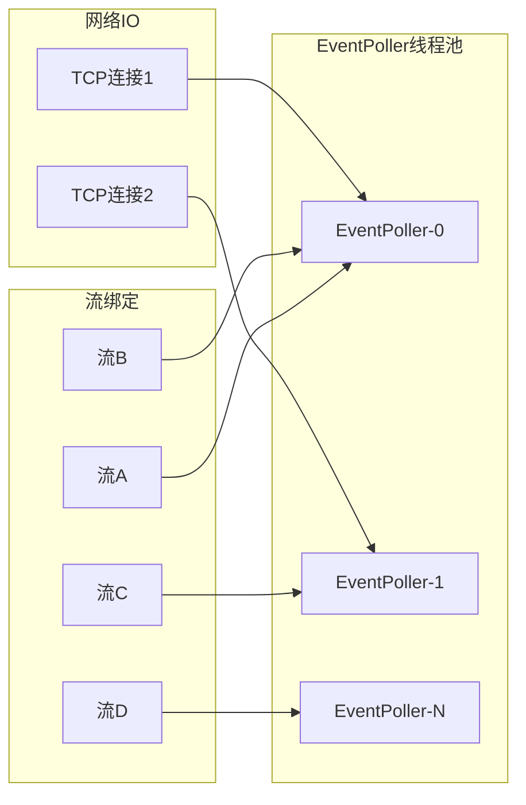

# 架构师指南

## 1. 系统设计思想

### 1.1 事件驱动异步架构

ZLMediaKit 基于 ZLToolKit 的事件驱动框架，所有网络 IO 操作均为异步非阻塞：

- **EventPoller**：每个线程对应一个 EventPoller，基于 epoll/kqueue/IOCP
- **多线程模型**：默认线程数 = CPU 核心数，每个流绑定到一个固定线程
- **无锁设计**：同一流的所有操作在同一线程执行，避免锁竞争



### 1.2 一推多播架构

核心设计：**一路推流，多路播放，多种协议**

```
推流端 → [一个 MultiMediaSourceMuxer] → 多个 MediaSource
                                          ├── RtspMediaSource → N 个 RTSP 播放器
                                          ├── RtmpMediaSource → N 个 RTMP 播放器
                                          ├── HlsMediaSource  → N 个 HLS 播放器
                                          ├── FMP4MediaSource → N 个 FMP4 播放器
                                          └── TSMediaSource   → N 个 TS 播放器
```

**优势：**
- 推流端只需推一路，服务器自动转换为多种协议
- 各协议的播放器数量不影响推流端性能
- 新增协议支持只需添加新的 Muxer，不影响现有代码

### 1.3 流注册中心

`MediaSource` 的全局注册表是整个系统的核心枢纽：

```cpp
// 全局流注册表（简化）
static map<string, map<string, weak_ptr<MediaSource>>> s_media_source_map;
// key: schema -> vhost/app/stream -> MediaSource
```

所有流的查找、注册、注销都通过这个注册表进行，实现了推流端和播放端的解耦。

---

## 2. 模块划分原则

### 2.1 协议无关的核心层

`src/Common/` 和 `src/Extension/` 是协议无关的核心层：
- `Frame`/`Track`：抽象的媒体数据表示，不依赖任何协议
- `MediaSource`：抽象的流管理，不依赖具体协议
- `MultiMediaSourceMuxer`：转协议引擎，通过接口与各协议 Muxer 交互

### 2.2 协议层的对称设计

每种协议都有对称的服务端/客户端实现：

| 协议 | 服务端（接收推流/提供播放） | 客户端（拉流/推流） |
|------|---------------------------|---------------------|
| RTSP | `RtspSession` | `RtspPlayer` / `RtspPusher` |
| RTMP | `RtmpSession` | `RtmpPlayer` / `RtmpPusher` |
| HTTP | `HttpSession` | `HttpClient` |

### 2.3 编解码层的插件化

`ext-codec/` 目录中的每种编解码格式都是独立的插件：
- 每种格式实现 `Track`、`RtpEncoder`、`RtpDecoder`、`RtmpEncoder`、`RtmpDecoder`
- 通过 `Factory` 工厂类统一创建
- 新增编解码格式只需在 `ext-codec/` 添加新文件，并在 `Factory` 中注册

---

## 3. 扩展性设计

### 3.1 添加新协议

以添加 SRT 协议为例：

1. 在 `srt/` 目录创建 `SrtSession.hpp`，继承 `toolkit::Session`
2. 实现 `onRecv()`，解析 SRT 数据包
3. 创建 `MultiMediaSourceMuxer`，将解析的帧数据输入
4. 在 `server/main.cpp` 中启动 SRT 服务器

```cpp
// 启动 SRT 服务器（示例）
auto srt_server = std::make_shared<UdpServer>();
srt_server->start<SrtSession>(srt_port);
```

### 3.2 添加新编解码格式

以添加 H266/VVC 为例：

1. 在 `ext-codec/` 创建 `H266.h/cpp`，继承 `VideoTrack`
2. 实现 `ready()`、`getSdp()`、`getExtraData()` 等方法
3. 创建 `H266Rtp.h/cpp`，实现 RTP 打包/解包
4. 在 `Factory.cpp` 中注册：
   ```cpp
   case CodecH266:
       return std::make_shared<H266Track>();
   ```
5. 在 `Frame.h` 的 `CODEC_MAP` 宏中添加 `CodecH266`

### 3.3 WebHook 扩展

通过 WebHook 可以在不修改 ZLMediaKit 源码的情况下扩展业务逻辑：

- **鉴权**：`on_publish`、`on_play`、`on_rtsp_auth`
- **流管理**：`on_stream_changed`、`on_stream_not_found`、`on_stream_none_reader`
- **录制通知**：`on_record_mp4`、`on_record_ts`
- **流量统计**：`on_flow_report`

### 3.4 Python 插件

ZLMediaKit 支持 Python 插件（需编译时启用 `ENABLE_PYTHON`）：

```python
# 示例：Python 插件实现推流鉴权
def on_publish(type, args, invoker, sender):
    if args['stream'] == 'secret_stream':
        invoker('', {})  # 允许推流
    else:
        invoker('unauthorized', {})  # 拒绝推流
    return True  # 返回 True 表示已处理，不再触发 WebHook
```

---

## 4. 性能考虑

### 4.1 内存管理

- **`shared_ptr` 引用计数**：所有媒体数据使用 `shared_ptr` 管理，避免手动内存管理
- **零拷贝**：`FrameFromPtr`、`FrameInternal` 等类实现零拷贝帧切割
- **对象池**：`ResourcePool<FrameImp>` 可选的对象池（代码中有注释掉的实现）
- **GOP 缓存限制**：通过 `kUnreadyFrameCache` 限制未就绪时的帧缓存数量

### 4.2 CPU 优化

- **按需转协议**：无播放器时不进行协议转换
- **线程亲和性**：每个流绑定到固定线程，减少缓存失效
- **批量发送**：合并写（`kMergeWriteMS`）减少系统调用

### 4.3 网络优化

- **TCP_NODELAY**：默认开启，减少延迟
- **SO_REUSEPORT**：多线程监听同一端口，提高并发接受连接能力
- **发送缓冲区**：可配置 TCP 发送缓冲区大小

### 4.4 性能基准（参考）

在普通服务器（8核 16GB）上的参考性能：
- 推流并发：1000+ 路（取决于编码复杂度）
- 播放并发：10000+ 路（HTTP-FLV，取决于带宽）
- 转协议延迟：< 100ms（RTMP → RTSP）

---

## 5. 高可用设计

### 5.1 集群模式

ZLMediaKit 支持边缘-源站集群模式：

```
推流端 → 源站 ZLMediaKit
              ↓ (按需拉流)
边缘站 ZLMediaKit ← 播放端
```

配置 `cluster.origin_url` 指定源站地址，边缘站在找不到流时自动从源站拉流。

### 5.2 断连续推

推流端断开后，ZLMediaKit 会等待 `continue_push_ms` 毫秒，在此期间：
- 播放器不会断开（可能短暂卡顿）
- 若推流端重连，无缝继续
- 超时后才真正关闭流

### 5.3 按需拉流

通过 `on_stream_not_found` WebHook，可以实现按需拉流：
1. 播放器请求某个流
2. 流不存在，触发 `on_stream_not_found`
3. 业务服务器收到通知，调用 `addStreamProxy` API 拉流
4. 流就绪后，播放器自动开始播放

---

## 6. 安全设计

### 6.1 鉴权机制

- **推流鉴权**：`on_publish` WebHook
- **播放鉴权**：`on_play` WebHook
- **RTSP 专有认证**：Digest MD5 认证
- **API 密钥**：`api.secret` 保护 REST API
- **IP 白名单**：`http.allowIPRange` 限制 API 访问

### 6.2 SSL/TLS 支持

- RTMPS（RTMP over TLS）：端口 19350
- RTSPS（RTSP over TLS）：端口 332
- HTTPS：端口 443
- WSS（WebSocket over TLS）

### 6.3 流量控制

- `on_flow_report`：流量统计，可用于计费
- `on_stream_none_reader`：无人观看时关闭流，节省带宽
